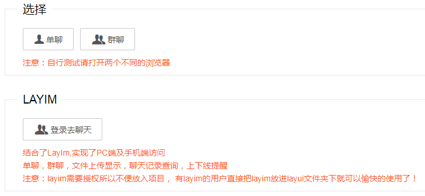
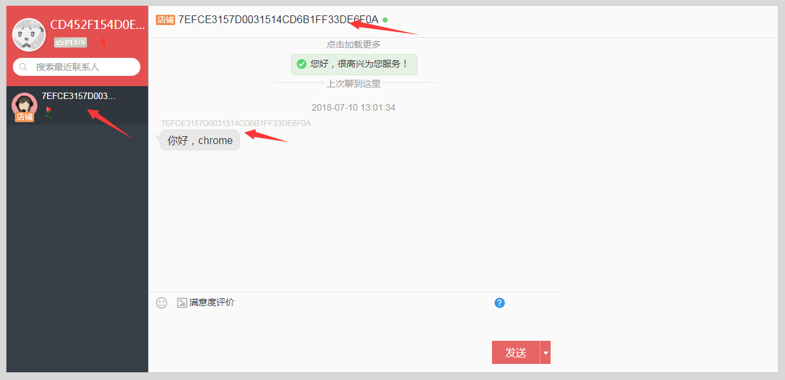
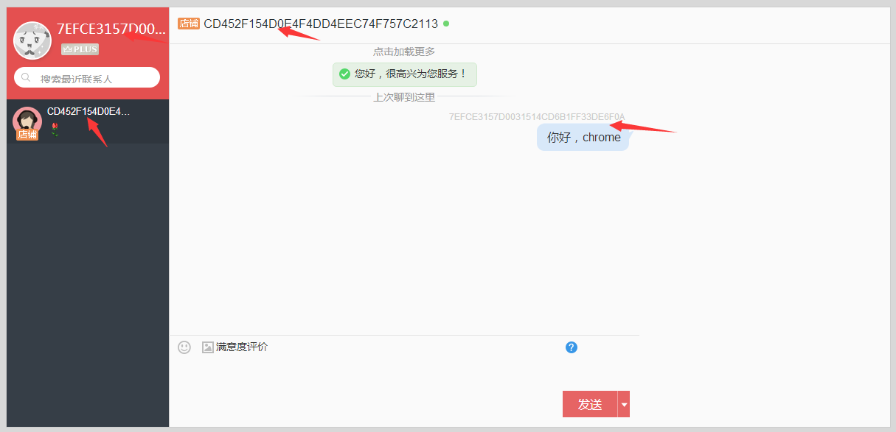
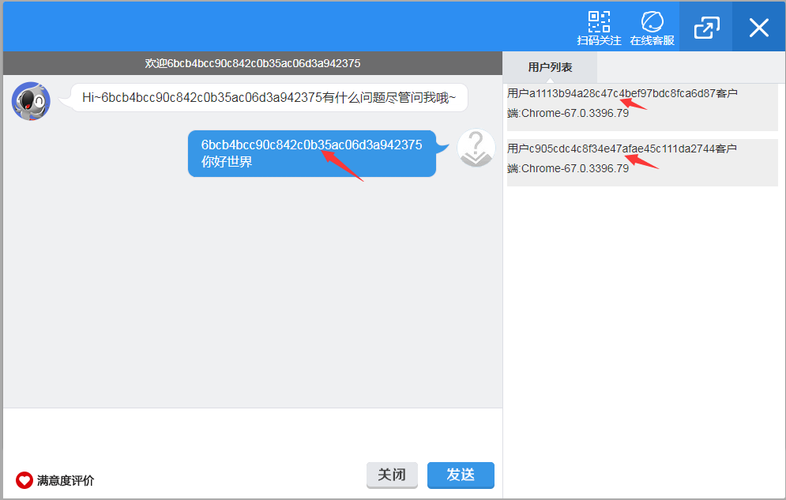
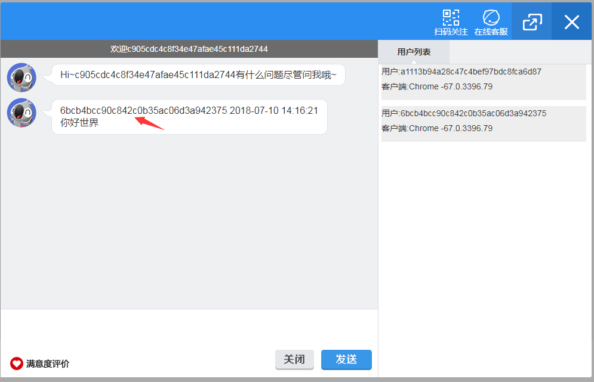
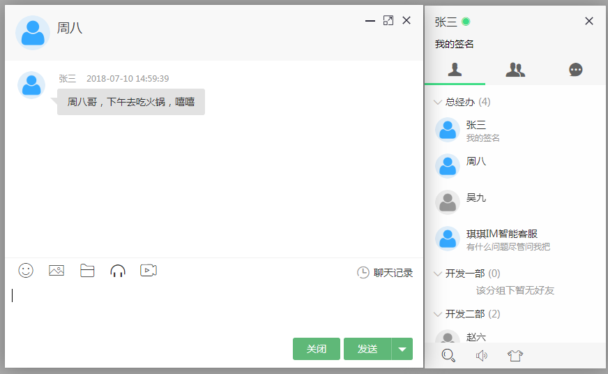
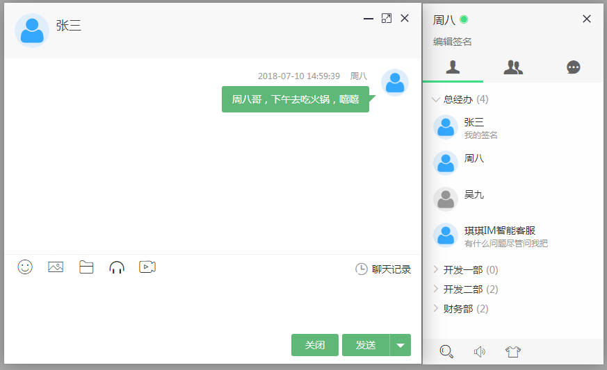
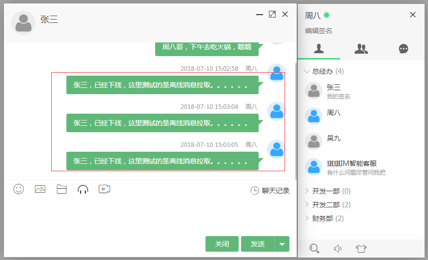
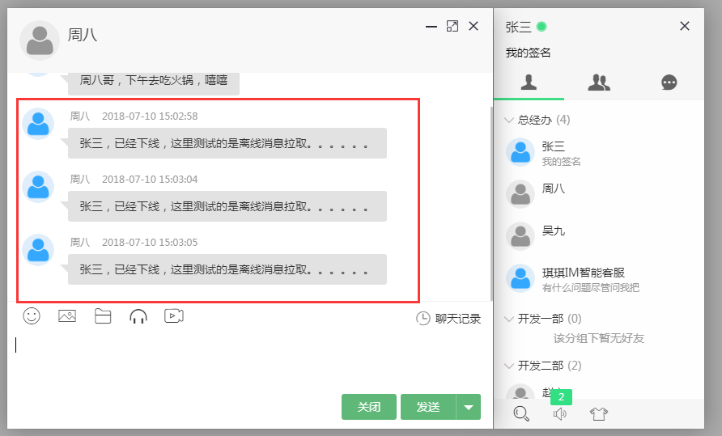

# X-IM
springBoot2,websocket,Protobuf,LayIM,thymeleaf 等构建的实时通讯项目.
## 开发模块
* 单聊，群聊
* LayIm实时通讯
开发这可以先通简单的单聊开始，配合doc目录下的**X-IM及时通信项目开发文档-version1.0.docx**
快速了解X-IM的项目的数据流程。熟悉整个流程后，读者可以根据自己的业务需求快速完成自己的实时通信! 

##技术栈
* springBoot2.0.3
* netty4.0
* websocket
* mybatis
* thymeleaf
## 项目截图
+ 1 index.html页面 
  
+ 2 单聊页面（chat.html） 
  在chrome和360流量器中分别打开 **http://localhost:8090/chat** 
  **注意同一个流量器打开算是一个用户，因为单聊页面使用session来识别用户的，所以同一个流量器里面
  的多个单聊页面会共享一个session，但是能够同时与其他流量器的客户端通信**
  
  
  可以看到两个客户端可以成功的通信！！！ 
+ 3 群聊页面（group.html）
  在任意流量器打开多个**http://localhost:8090/groupChat**
  
  
+ 4 LayIm实时通讯
  由于LayIm不是免费的，所以读者需要自己去LayIm官方网站**http://layim.layui.com/**申请。然后将
  layim.js和layim.css分别放到目录:
  * /static/layui/lay.modules/
  * /static/layui/css/modules/layim/ 
  从首页中进入登录页面，可以使用已经存在的用户名和密码登录（数据库的user_account表），也可以注册新的
  用户。这里分别登录张三和周八的账户：
  
  
  同时，这里也支持离线消息。比如关闭张三，周八发送多条消息给他，然后再登录周八账户。
  
  
  
 
 ## 后期完善
   添加Spring Security OAuth2,完善用户管理模块。
  
   

